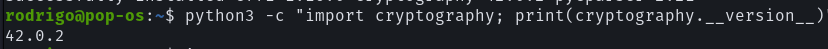

# Respostas das Questões

## Q1

Depois de instalada, a biblioteca `cryptography` foi atualizada com o seguinte comando:

```bash
pip install --upgrade cryptography
```



# Relatório do Guião da Semana 2

