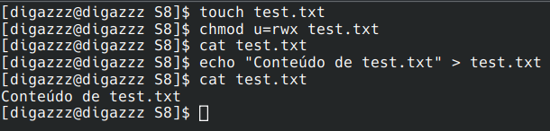
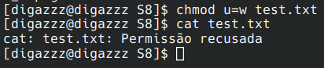
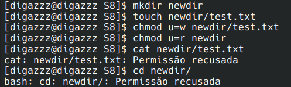
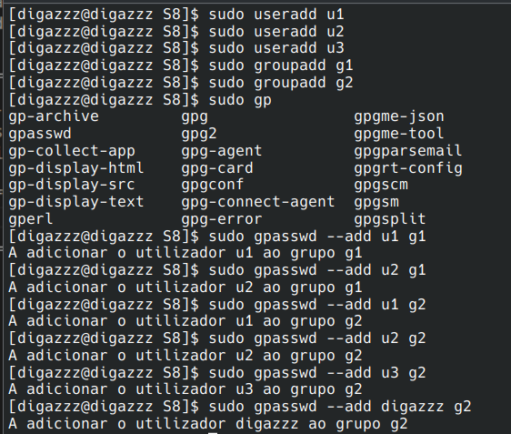
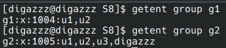
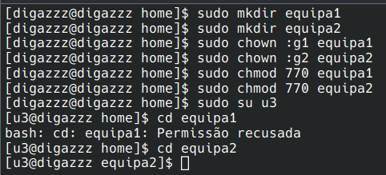
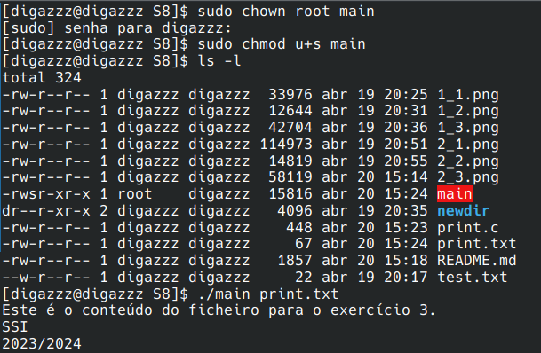
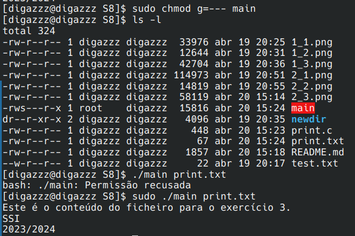
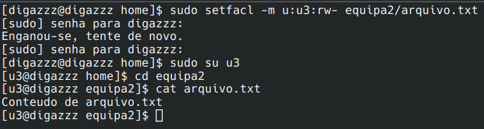

# Q1

- Criar ficheiros, exercitar permissões e controlo de acesso
- Criar diretorias (contendo ficheiros), exercitar permissões e controlo de acesso (tenha em conta a semântica particular das permissões em diretorias e o controlo de acesso em cada componente do caminho para um ficheiro ou diretoria)

Usando o comando `chmod u=rwx` permitimos que o utilizador tenha acesso ao ficheiro, sendo possível lê-lo e também escrever nele.

Alterando o comando para `chmod u=w` apenas é possível ao utilizador escrever nele, obtendo o erro de permissão recusado se o quiser ler ou acessar.

Criou-se uma diretoria `newdir` com um ficheiro `test.txt`. Deu-se ao utilizador apenas a permissão de escrita no ficheiro e permissão de ler na diretoria. Ao tentar obter o conteúdo do ficheiro `test.txt` obteve-se o erro de permissão recusado pelo facto de o utilizador apenas poder escrever nele. Tentando acessar a diretoria através do comando `cd` obteve-se o mesmo erro pelo facto de o utilizador apenas poder ler da diretoria.

# Q2

- Criar utilizador para cada membro da equipa
- Criar grupos contendo dois elementos da equipa e um contendo todos os elementos da equipa
- Iniciar sessão com os diferentes utilizadores e revistar os exercício anteriores

Para este exercício foram criados 3 utilizadores (`u1`, `u2`, `u3`) e 2 grupos(`g1`, `g2`). 

A `g1` pertencem os utilizadores `u1` e `u2` enquanto que a `g2` pertencem todos os utilizadores presentes na máquina. 

De seguida, criaram-se duas diretorias: `equipa1` e `equipa2` sendo que o `g1` ficaria o proprietário da diretoria `equipa1` e o `g2` de `equipa2`. Deste modo, acedendo a `u3` que pertencia apenas a `g2`, este consegue aceder à diretoria `equipa2` mas não consegue aceder a `equipa1`.

# Q3

- Criar um programa binário executável que imprima o conteúdo de um ficheiro de texto cujo nome é
passado como único argumento da sua linha de comando (ou erro caso não o consiga fazer)
- Definir permissão de setuid para o ficheiro executável
- Revisitar os exercícios de permissões anteriores usando sessões com os diferentes utilizadores criados, nas
quais é invocado o programa executável com o setuid para o utilizador dono e se passa como argumento
o caminho para um ficheiro que só pode ser lido por esse dono
- Estudar os comandos su, sudo, passwd e gpasswd à luz das permissões base da de setuid (para root)

A função [print.c](print.c) imprime o conteúdo de um ficheiro no `stdout`. Definiu-se `root` como o proprietário do executável deste ficheiro (`main`). De seguida, decidiu-se implementar a permissão especial `setuid` com recurso ao comando equivalente `chmod u+s`. 

Decidiu-se depois retirar todas as permissões referentes ao executável. Deste modo, apenas seria possível acedê-lo usando `sudo`.

# Q4

- Definir permissões específicas para os utilizadores e grupos criados (via ACL estendida)
- Experimentar os mecanismos de controlo de acesso à luz das novas permissões definidas

Adicionou-se uma ACL para o utilizador `u3`. Este pode ler e escrever no ficheiro mas não o pode aceder. Testou-se a sua leitura com o comando `cat`.

